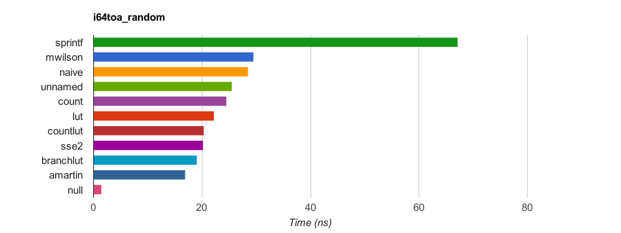
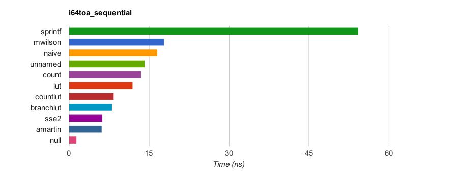

# itoa_ljust

Copyright(c) 2017 Jens Grabner

Copyright(c) 2016 Arturo Martin-de-Nicolas (arturomdn@gmail.com)
See [LICENSE file](LICENSE) for source code copyrights.

## Introduction

Fast and simple integer to ASCII conversion:
  * 8, 16, 32 and 64-bit integers
  * signed and unsigned
  * user supplied buffer must be large enough for all decimal digits in value plus minus sign if negative
  * left-justified
  * NUL terminated
  * return value is pointer to NUL terminator
  * for best performance, compile with -O3 optimization level
  * Tested with Arduino 8-bit Atmel µC

```c++
char* itoa_( uint8_t u, char* buffer);
char* itoa_(  int8_t i, char* buffer);
char* itoa_(uint16_t u, char* buffer);
char* itoa_( int16_t i, char* buffer);
char* itoa_(uint32_t u, char* buffer);
char* itoa_( int32_t i, char* buffer);
char* itoa_(uint64_t u, char* buffer);
char* itoa_( int64_t i, char* buffer);
```

## Files
  * itoa_ljust.h   - programming interface
  * itoa_ljust.cpp - implementation - compile and link with your application

## Performance Benchmark

This implemenation is incorporated in [Milo Yip's excellent itoa-benchmark](https://github.com/miloyip/itoa-benchmark) - it is called **_amartin_** there.

The benchmark uses sprintf as the baseline and compares various implementations running both sequential and random integer sequences for signed and unsigned integers of 32-bit and 64-bit sizes (8 different tests).

When compiled with gcc 5.3 at -O3 optimization level and run on an [Intel(R) Core(TM) i7-6700K CPU @ 4.00GHz](http://ark.intel.com/products/88195/Intel-Core-i7-6700K-Processor-8M-Cache-up-to-4_20-GHz) this implementation is the fastest in all categories (the **null** function does nothing, used to measure overhead of benchmark loop).

#### Results for random sequences of 64-bit signed integers

|Function |Time (ns)|Speedup|
|---------|--------:|------:|
|sprintf  |   67.161|  1.00x|
|mwilson  |   29.509|  2.28x|
|naive    |   28.426|  2.36x|
|unnamed  |   25.490|  2.63x|
|count    |   24.523|  2.74x|
|lut      |   22.142|  3.03x|
|countlut |   20.377|  3.30x|
|sse2     |   20.201|  3.32x|
|branchlut|   19.098|  3.52x|
|**amartin**  |   16.845|  3.99x|
|null     |    1.424| 47.18x|



#### Results for sequential sequences of 64-bit signed integers

|Function |Time (ns)|Speedup|
|---------|--------:|------:|
|sprintf  |   54.168|  1.00x|
|mwilson  |   17.785|  3.05x|
|naive    |   16.507|  3.28x|
|unnamed  |   14.151|  3.83x|
|count    |   13.491|  4.02x|
|lut      |   11.945|  4.53x|
|countlut |    8.403|  6.45x|
|branchlut|    8.028|  6.75x|
|sse2     |    6.261|  8.65x|
|**amartin**  |    6.106|  8.87x|
|null     |    1.421| 38.13x|


